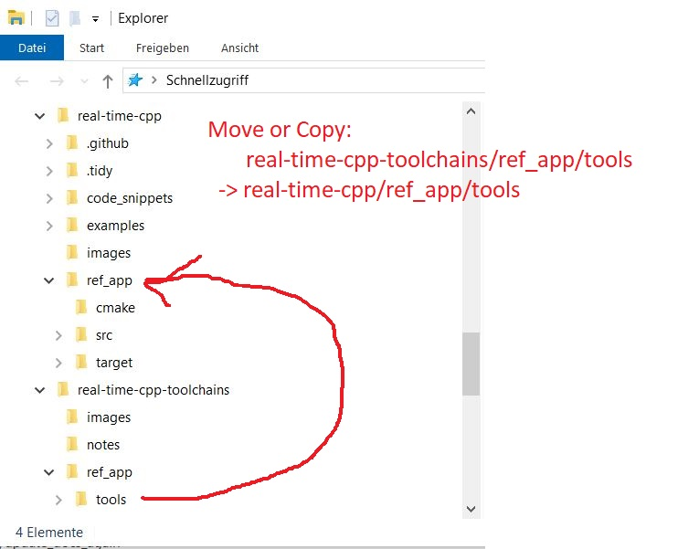
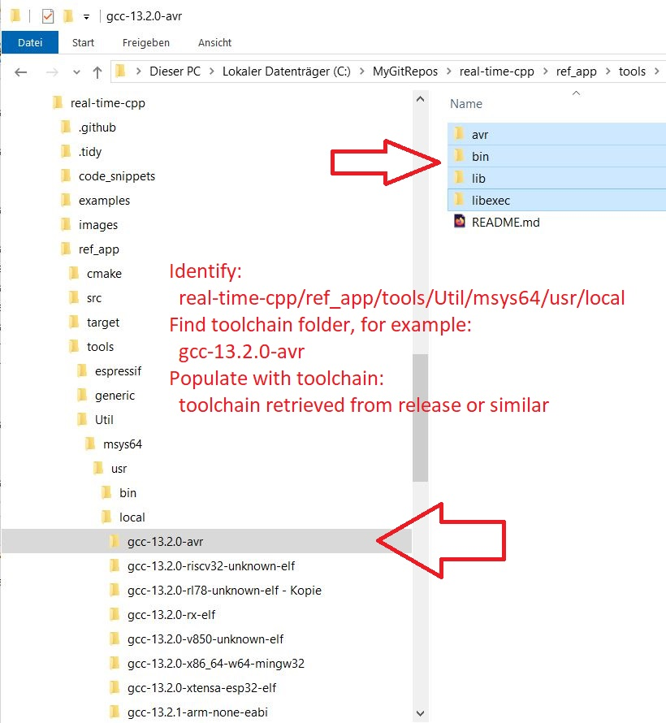

real-time-cpp-toolchains
==================

This repository provides information and links to GNU/GCC toolchains
synchronized with [real-time-cpp](https://github.com/ckormanyos/real-time-cpp).
They can be used (among other purposes) for building the reference application
(`ref_app`) for embedded targets and the examples on `Win*` and/or `*nix`.

## Supported Toolchain Targets

| GCC target             | location              |
| ---------------------- | --------------------- |
| `arm-none-eabi`        | [ARM(R) GNU Toolchain](https://developer.arm.com/downloads/-/arm-gnu-toolchain-downloads)  |
| `avr`                  | [ckormanyos/avr-gcc-build](https://github.com/ckormanyos/avr-gcc-build)                    |
| `riscv32-unknown-elf`  | [embecosm](https://www.embecosm.com/resources/tool-chain-downloads/#riscv-stable)          |
| `rl78-unknown-elf`     | [ckormanyos/gcc-rl78-unknown-elf](https://github.com/ckormanyos/gcc-rl78-unknown-elf)      |
| `rx-elf`               | [ckormanyos/gcc-rx-elf](https://github.com/ckormanyos/gcc-rx-elf)                          |
| `v850-unknown-elf`     | [ckormanyos/gcc-v850-unknown-elf](https://github.com/ckormanyos/gcc-v850-unknown-elf)      |
| `x86_64-w64-mingw32`   | [nuwen distro](https://nuwen.net/mingw.html)                                               |
| `xtensa-esp32-elf`     | [espressif/crosstool-NG](https://github.com/espressif/crosstool-NG)                        |

## Further details

The references usually include GNU/GCC toolchains built to run on
`Win*` and also toolchains built to run on `*nix` (and maybe others).
The `Win*` versions, in particular,
can be used by developers who optionally run the builds in the
[real-time-cpp](https://github.com/ckormanyos/real-time-cpp)
repository on `Win*` batches or in Microsoft(R) VisualStudio(R).
Other standalone uses for any of these toolchains are, of course, possible.

The toolchains are typically completely moveable, entirely dependency-free (no DLLs),
and built to run out-of-the-box.

# Finding/Extracting the GNU/GCC Toolchains

Consult the links for the relevant toolchain(s) either in the table above or in the
[ref_app/tools/Util/msys64/usr/local](./ref_app/tools/Util/msys64/usr/local)
directory.

Consider, for instance, the `gcc-avr` toolchain.
It available in the release(s) of
[ckormanyos/avr-gcc-build](https://github.com/ckormanyos/avr-gcc-build).

The entire content of the relevant toolchain's directory are intended
to be moved or copied to the corresponding `ref_app` folder in
[real-time-cpp](https://github.com/ckormanyos/real-time-cpp).

In steps:
  - Move or Copy: `real-time-cpp-toolchains/ref_app/tools` -> `real-time-cpp/ref_app/tools`.
  - Identify: `real-time-cpp/ref_app/tools/Util/msys64/usr/local`.
  - Find toolchain folder, for example: `gcc-13.2.0-avr`.
  - Populate `gcc-13.2.0-avr` with toolchain retrieved from release or similar.
  - Use a similar process if a different toolchain is needed (like for ARM(R), or others).

These steps are depicted in the images below.

<h4><strong>Move or Copy `tools`</strong></h4>

<kbd></kbd>

<h4><strong>Populate Toolchain</strong></h4>

<kbd></kbd>

# Using GNU/GCC Toolchains in the `ref_app` VS Solution

The GNU/GCC toolchains harmonize for use with the [real-time-cpp](https://github.com/ckormanyos/real-time-cpp) repository.
  - Clone (or get zip of) the [real-time-cpp](https://github.com/ckormanyos/real-time-cpp) repository, which is the main companion code for the book.
  - Consult the toolchain's notes in the [real-time-cpp-toolchains](https://github.com/ckormanyos/real-time-cpp-toolchains) repository, which is this repository.
  - Get the needed toolchain from its release or third-party location. Save it and extract its archive.
  - Move or copy the extracted toolchain to the corresponding location in the [real-time-cpp](https://github.com/ckormanyos/real-time-cpp) repository directory tree.
  - Open the `ref_app.sln` VisualStudio(R) solution as shown below.
  - Select the solution configuration and rebuild it. The results are placed in the temporary `ref_app/bin` directory

