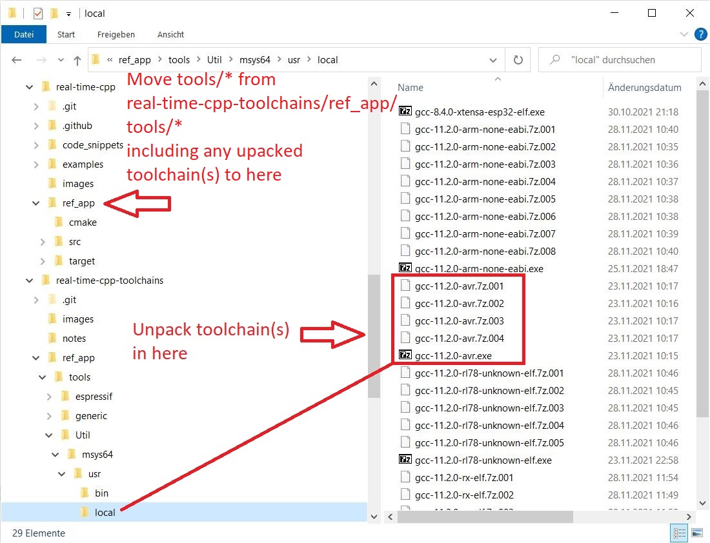
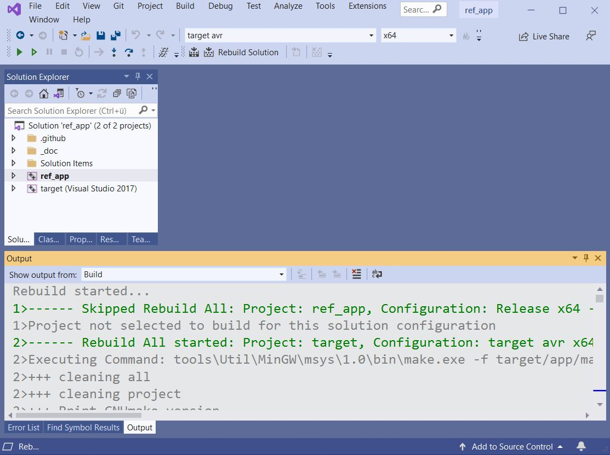

# GNU/GCC Toolchains for [real-time-cpp](https://github.com/ckormanyos/real-time-cpp) on Windows

This repository stores GNU/GCC toolchains needed
for building `ref_app` targets found in the repository
[real-time-cpp](https://github.com/ckormanyos/real-time-cpp).

These GNU/GCC toolchains are built to run on Windows(R).
They are intended to be used by developers who optionally
run the builds in the
[real-time-cpp](https://github.com/ckormanyos/real-time-cpp)
repository on `Win*` batches or in Microsoft(R) VisualStudio(R).

Other standalone uses are, of course, possible with these toolchains.
They are completely moveable and built to run out-of-the-box.
Do note, however, that the dynamic link library `libwinpthread-1.dll`
is required for running these GCC ports.
A copy of `libwinpthread-1.dll` can be found
[here](https://github.com/ckormanyos/real-time-cpp-toolchains/tree/master/ref_app).

## Supported Toolchain Targets

| GCC target             | GCC version   | C-Library     | libbfd version  | Build hours `mingw64` |
| ---------------------- | ------------- | ------------- | --------------- | --------------------- |
| `arm-none-eabi`        | 11.2.0        | newlib 4.1.0  | binutils 2.37   | 8                     |
| `avr`                  | 11.2.0        | avr-libc3     | binutils 2.37   | 2                     |
| `rl78-unknown-elf`     | 11.2.0        | newlib 4.1.0  | binutils 2.37   | 2                     |
| `rx-elf`               | 11.2.0        | newlib 4.1.0  | binutils 2.37   | 5                     |
| `v850-unknown-elf`     | 11.2.0        | newlib 4.1.0  | binutils 2.37   | 4                     |
| `x86_64-w64-mingw32`   | 11.2.0        |               |                 | Use [nuwen distro](https://nuwen.net/mingw.html) |

## If you just want the toolchains

If you simply want the GNU/GCC toolchains and have your own specialized use for them, they can be found in the [ref_app/tools/Util/msys64/usr/local](./ref_app/tools/Util/msys64/usr/local) directory.

## Build details

All GCC builds (including binutils and prerequisites) have been performed
on [mingw64/msys2](https://www.msys2.org) with `--host=x86_64-w64-mingw32`.

The following packages and prerequisites have been used.
Each package and prerequisite has been built on `--host=x86_64-w64-mingw32`
(favoring static linkage using flags `--disable-shared` and `--enable-static`).
  - libiconv 1.16 (package)
  - GMP 6.2.1 (prerequisite)
  - MPFR 4.1 (prerequisite)
  - MPC 1.2.1 (prerequisite)
  - ISL 0.15 (prerequisite)
  - cloog 0.18.1 (package)

One single mingw64 DLL --- [`libwinpthread-1.dll`](https://github.com/ckormanyos/real-time-cpp-toolchains/tree/master/ref_app) ---
is required to run the compilers once they have been built.
(See [this issue](https://github.com/ckormanyos/real-time-cpp-toolchains/issues/2)
for tracking the attempt to remove this remaining dependency.)

# Finding/Extracting the GNU/GCC Toolchains

GNU/GCC toolchains are stored as self-extracting archives in the
[ref_app/tools/Util/msys64/usr/local](./ref_app/tools/Util/msys64/usr/local)
directory.

The JPG image below
depicts the topology of the GNU/GCC toolchains in the
[real-time-cpp-toolchains](https://github.com/ckormanyos/real-time-cpp-toolchains)
repository and how these topologically harmonize with the `ref_app`
in the [real-time-cpp](https://github.com/ckormanyos/real-time-cpp) repository.



Consider, for instance, the `gcc-avr` toolchain version 11.2.0.
It is stored in the executable file `gcc-11.2.0-avr.exe`.
This file has been split into several self-extracting
archives in order to limit individual file storage to 64MB.

This file (and its affiliated sub-archives) can be extracted,
for example, via double click or suitable command
on the command line (cmd).

For instance, extract `gcc-11.2.0-arv.exe` in `Win*` with the command:

```cmd
start /b /wait ./gcc-11.2.0-avr.exe -y -gm2 -InstallPath=".\\gcc-11.2.0-avr"
```

Upon extraction of one or more of the toolchains,
the entire contents of of the `tools` directory are intended
to be moved or copied to the `ref_app` folder in
[real-time-cpp](https://github.com/ckormanyos/real-time-cpp).

The `tools` directory (after extracting the self-extracting GNU/GCC archives)
is intended to be copied or dragged-and-dropped to within the `ref_app`
directory of [real-time-cpp](https://github.com/ckormanyos/real-time-cpp).
This creates the directory `ref_app\tools` which subsequently
enables the MSVC GNU/GCC target builds to work out-of-the-box in `ref_app.sln`,
when opened in Microsoft(R) VisualStudio(R).

# Using GNU/GCC Toolchains in the `ref_app` VS Solution

The GNU/GCC toolchains harmonize for use with the [real-time-cpp](https://github.com/ckormanyos/real-time-cpp) repository.
  - Clone (or get zip of) the [real-time-cpp](https://github.com/ckormanyos/real-time-cpp) repository, which is the main companion code for the book.
  - Clone (or get zip of) the [real-time-cpp-toolchains](https://github.com/ckormanyos/real-time-cpp-toolchains) repository, which is this repository.
  - Step 1. Extract one or more of the GNU/GCC toolchains in [ref_app/tools/Util/msys64/usr/local](./ref_app/tools/Util/msys64/usr/local) directory. The executable files are self-extracting archives that extract in-place where they are intended to be, such as via double-click.
  - Step 2. Following toolchain extraction(s), move or copy the [ref_app/tools](./ref_app/tools) directory from `real-time-cpp-toolchains` (this repository) to the corresponding location in the [real-time-cpp](https://github.com/ckormanyos/real-time-cpp) repository directory tree.
  - Open the `ref_app.sln` VisualStudio(R) solution as shown below.
  - Select the solution configuration `target avr` and rebuild it. The results are placed in the temporary `ref_app/bin` directory



# Building a GCC Cross Toolchain on msys2/mingw64

## Notes

Full notes and instructionis on building various GCC cross toolchains
on `msys2`/`mingw64` are provided in the [notes](./notes) directory.

## Sources and Patches

TBD: Provide links to source archive(s)
and also provide any used patch files for
libiconv, gmp, mpfr, mpc, isl, cloog, binutils, libiconv, avr-libc3, etc.

TBD: Create and publish patch files for binutils, libiconv, avr-libc3, etc.
